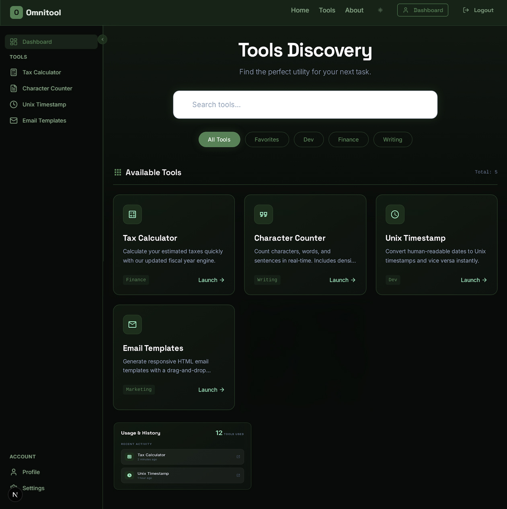

# The Omnitool (MyTools)

[](https://github.com/iamxdv30/TheOmnitool/releases)
[](https://www.python.org/)
[](https://flask.palletsprojects.com/)
[](https://nextjs.org/)
[](https://react.dev/)
[](#testing)
[](#license)

A full-stack SaaS-style utility platform combining a Flask backend with a modern Next.js 16 / React 19 frontend, built to demonstrate production-grade architecture: role-based access control, a subscription/paid-tier system, a service-layer design, dual-stack deployment on Heroku, and an automated CI/CD pipeline with migration safety and rollback.

Live product: a dashboard of tools (tax calculators, character counter, email templates, and more) gated by user role and subscription plan, with favorites, usage history, and search.

See the full [Changelog](CHANGELOG.md) for release history.

---

## Table of Contents

- [Why This Project](#why-this-project)
- [Features](#features)
- [Tech Stack](#tech-stack)
- [Architecture](#architecture)
- [Screenshots](#screenshots)
- [Getting Started](#getting-started)
- [Testing](#testing)
- [Deployment](#deployment)
- [Project Structure](#project-structure)
- [Security](#security)
- [Roadmap](#roadmap)
- [License](#license)
- [Author](#author)

---

## Why This Project

The Omnitool started as a simple Flask utility site and was progressively re-architected into a two-frontend, service-oriented application without a rewrite-from-scratch — the kind of incremental migration real production systems require. It showcases:

- **Legacy-to-modern migration** — a server-rendered Jinja2 app running side-by-side with a new Next.js/React frontend consuming a versioned JSON API, migrated in phases with zero downtime.
- **Layered backend architecture** — routes → services → models, using the Service Result pattern instead of exceptions for control flow, keeping HTTP concerns out of business logic.
- **Real access-control and billing modeling** — role-based permissions (User/Admin/SuperAdmin) plus a provider-agnostic subscription/plan system that gates premium tools by tier.
- **Operational maturity** — automatic pre-migration database backups, health-check endpoints, CI/CD with automatic rollback on failed migrations, and Discord deployment notifications.
- **Security-first iteration** — a self-directed audit that found and fixed a CSRF-token-issued-but-never-validated gap, added session fixation protection, and removed secrets from logs (see [Changelog v1.5.0](CHANGELOG.md)).

## Features

### Tools Discovery Dashboard
- Debounced full-text search across tool names and descriptions
- Category filter pills (All Tools, Favorites, admin-managed categories)
- Per-user favorites synced across devices with optimistic UI updates
- Recent activity feed with relative timestamps and usage counters
- Premium tools show their required plan and an upgrade banner when locked

### Tools Included
- US Tax Calculator, Canada Tax Calculator, and VAT Calculator — unified into a single tabbed widget with state persistence and URL-hash bookmarking
- Character Counter
- Email Templates (per-user, full CRUD)

### Access Control & Subscriptions
- Role-based access control: **User → Admin → SuperAdmin**, modeled with Single Table Inheritance
- Per-tool access grants (`ToolAccess`) with sensible defaults for new users
- Subscription plans (Free/Basic/Pro) with billing cycles and provider-agnostic payment modeling; paid tools unlock automatically when a user's plan tier is sufficient

### Platform
- Dual-stack deployment (Flask + Next.js) on a single Heroku dyno
- CSRF-protected JSON API with session-based auth for the SPA frontend
- Automated database backups before every migration, with one-command restore
- Health-check endpoints for both the Flask backend and the Next.js frontend
- 3D interactive UI (React Three Fiber + Rapier physics) on the modern frontend

## Tech Stack

| Layer | Technology |
|---|---|
| **Backend** | Python 3, Flask 3.0.3 (Application Factory pattern), SQLAlchemy 2.0, Flask-Migrate/Alembic, Gunicorn |
| **Modern Frontend** | Next.js 16 (App Router), React 19, TypeScript, Tailwind CSS v4, Zustand v5 |
| **3D/Interactive** | React Three Fiber v9, @react-three/drei, @react-three/rapier |
| **Legacy Frontend** | Jinja2 server-rendered templates, vanilla JS/jQuery |
| **Database** | PostgreSQL (production, staging, and Docker-based local dev); SQLite fallback/tests |
| **Auth & Security** | Flask-Login-style session auth, Bcrypt (Strategy pattern), CSRF tokens, reCAPTCHA, HSTS/CSP headers |
| **Testing** | Pytest (backend, 147 tests), Jest + React Testing Library (frontend, 39 tests) |
| **CI/CD** | GitHub Actions — staging + production pipelines with automatic pre-migration backup and rollback |
| **Hosting** | Heroku (dual-stack: Flask + Next.js on one dyno), Docker Compose for local PostgreSQL |

## Architecture

```
                         ┌─────────────────────────┐
                         │        Browser          │
                         └────────────┬────────────┘
                                      │
                     ┌────────────────┴─────────────────┐
                     │                                   │
             Legacy routes (SSR)                  Next.js frontend
             /login, /dashboard, ...               /dashboard, /tools, ...
                     │                                   │
                     │                          rewrites /api/* ──────┐
                     ▼                                                ▼
        ┌────────────────────────────────────────────────────────────────┐
        │                      Flask Application                        │
        │  routes/*  (legacy, Jinja)      routes/api/v1/*  (JSON API)    │
        │        │                                  │                    │
        │        └───────────────┬──────────────────┘                    │
        │                        ▼                                       │
        │              services/*  (business logic, ServiceResult<T>)    │
        │                        ▼                                       │
        │              model/*  (SQLAlchemy ORM, STI for users)          │
        └────────────────────────────┬───────────────────────────────────┘
                                      ▼
                            PostgreSQL / SQLite
```

**Design patterns used:**
- **Application Factory** — `create_app()` builds and configures the Flask app; enables isolated test configs.
- **Factory Pattern** — `UserFactory.create_user()` centralizes role-based user instantiation (User/Admin/SuperAdmin).
- **Strategy Pattern** — `PasswordHasher` abstract base class with a swappable `BcryptPasswordHasher` implementation.
- **Single Table Inheritance** — `User` → `Admin` → `SuperAdmin` share one table, polymorphic on `role`.
- **Service Result Pattern** — every service method returns `ServiceResult[T]` (`.is_success`, `.data`, `.error`) so routes stay thin and error handling is uniform across the API.

## Screenshots

### Tools Discovery Dashboard



The redesigned dashboard (v1.5.0): debounced search, category filter pills, tool cards with launch actions, and a recent-activity feed — rendered in the "Sage Tech" dark theme.

## Getting Started

### Prerequisites
- Python 3.x
- Node.js 20.x (for the Next.js frontend)
- Docker (recommended, for local PostgreSQL)

### Backend Setup
```bash
# 1. Clone and install dependencies
git clone https://github.com/iamxdv30/TheOmnitool.git
cd TheOmnitool
pip install -r requirements.txt

# 2. Configure environment
cp .env.example .env   # then fill in SECRET_KEY, SECURITY_PASSWORD_SALT, etc.

# 3. Start PostgreSQL via Docker (recommended)
.\scripts\docker-db.ps1 start   # Windows
./scripts/docker-db.sh start    # Linux/Mac

# 4. Run database migrations (creates schema, auto-backs-up first)
python migrate_db.py

# 5. Seed default tools and dashboard data
python tool_management.py
python scripts/seed_phase1_dashboard_data.py

# 6. Run the Flask backend
python main.py
```

### Frontend Setup (optional — modern Next.js UI)
```bash
cd frontend
npm install
npm run dev
```

Visit `http://localhost:5000` for the legacy server-rendered app, or `http://localhost:3000` for the Next.js frontend (proxies API calls to Flask).

### Health Checks
```bash
curl http://localhost:5000/health          # Full backend health check
curl http://localhost:5000/health/ping     # Simple ping
curl http://localhost:5000/health/database # Database status
```

## Testing

```bash
# Backend (147 tests)
pytest
pytest --cov=. --cov-report=html

# Frontend (39 tests)
cd frontend
npm test
npm test -- --coverage
```

Test fixtures (`tests/conftest.py`) spin up an isolated in-memory SQLite app via `create_app(test_config=...)`, with pre-populated fixtures for `logged_in_user`, `logged_in_admin`, and `logged_in_superadmin`.

## Deployment

Deployed to Heroku using a **dual-stack architecture** — Flask (Gunicorn) runs as a background process while Next.js serves as the foreground process on Heroku's assigned `$PORT`, with Next.js rewriting `/api/*` requests to the Flask backend.

```bash
heroku buildpacks:add heroku/python   # order matters
heroku buildpacks:add heroku/nodejs
```

CI/CD (`.github/workflows/`) runs on every push to staging/production branches:
1. Full PostgreSQL backup before any migration runs
2. `flask db upgrade` with error tracking
3. **Automatic rollback** from the backup dump if the migration fails — zero manual intervention, zero downtime for users
4. Discord notifications at every step (backup, migration, success/failure)
5. Post-deploy smoke tests

## Project Structure

```
├── main.py                  # App factory, logging, security headers
├── model/                   # SQLAlchemy models (users, tools, subscriptions)
├── routes/                  # Legacy Jinja routes + routes/api/v1 JSON API
├── services/                # Business logic layer (ServiceResult pattern)
├── Tools/                   # Standalone tool computation logic + templates
├── templates/                # Jinja2 templates
├── frontend/                 # Next.js 16 / React 19 application
│   └── src/
│       ├── app/               # App Router pages (public/auth/dashboard groups)
│       ├── components/        # UI, 3D canvas, layout components
│       ├── store/              # Zustand state (auth, UI, theme)
│       └── lib/api/            # Typed API client with CSRF handling
├── scripts/                  # Migration, backup, seeding, and sync utilities
├── tests/                    # Pytest suite + smoke tests
└── docs/                     # Architecture and workflow documentation
```

## Security

- CSRF tokens are issued and **enforced** on every mutating `/api/v1` request (`X-CSRFToken` header)
- Sessions are rotated on login to prevent session fixation
- Passwords hashed with Bcrypt via a swappable `PasswordHasher` strategy — plaintext passwords are never set directly
- Production enforces HTTPS, HSTS, and CSP headers; secrets are excluded from logs
- reCAPTCHA on authentication forms and enforced email verification before tool access

## Roadmap

- [ ] Payment provider integration (Stripe/PayPal subscribe, cancel, webhooks)
- [ ] Manual responsive/theme QA pass on the redesigned dashboard
- [ ] Additional tools and category expansion

## License

This project is currently unlicensed for public reuse; all rights reserved by the author. Contact the author if you'd like to discuss usage.

## Author

**Xyrus De Vera**
GitHub: [@iamxdv30](https://github.com/iamxdv30)
